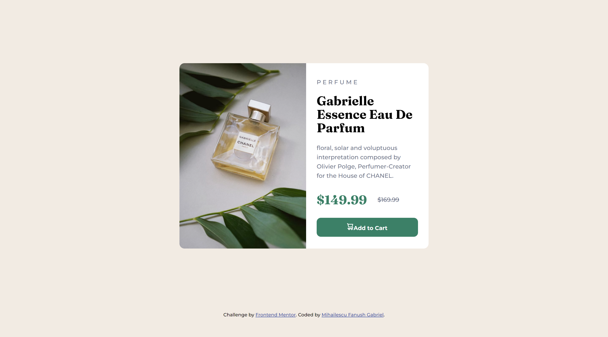
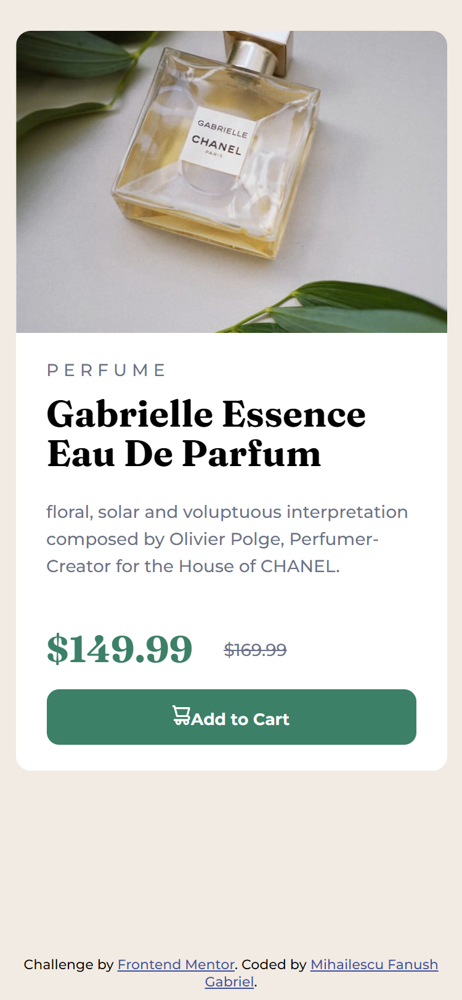

# Frontend Mentor - Product preview card component solution

This is a solution to the [Product preview card component challenge on Frontend Mentor](https://www.frontendmentor.io/challenges/product-preview-card-component-GO7UmttRfa). Frontend Mentor challenges help you improve your coding skills by building realistic projects. 

## Table of contents

- [Overview](#overview)
  - [The challenge](#the-challenge)
  - [Screenshot](#screenshot)
  - [Links](#links)
  - [Built with](#built-with)
  - [What I learned](#what-i-learned)
  - [Useful resources](#useful-resources)
- [Author](#author)

### Screenshot

### Links

- Solution URL: (https://github.com/Fanushhh/Product-review-card)
- Live Site URL:(https://fanushhh.github.io/Product-review-card/)

### Built with

- Semantic HTML5 markup
- CSS custom properties
- Flexbox

### What I learned

With this challenge, I worked with flexbox which kinda helped me understand it more and the differences between flex and css-grid.

### Useful resources

- [Flex display documentation](https://developer.mozilla.org/en-US/docs/Web/CSS/flex) - This helped me with the properties of flex, especially for the mobile version where I had to change the flex orientation to column

## Author

- Website - [Mihailescu Fanush Gabriel](https://fanushhh.github.io/Stylized-Website/)
- Frontend Mentor - [@Fanushhh](https://www.frontendmentor.io/profile/Fanushhh)

